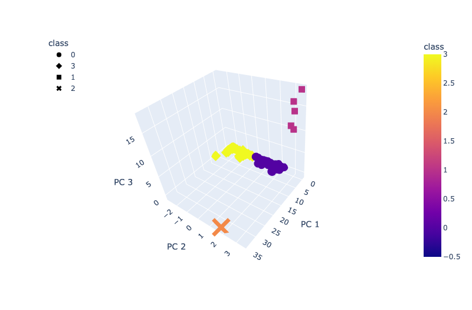

# Crytocurrency

Cryptocurrency Clustering with Unsupervised Machine Learning.

## Purpose: 

 The purpose of this project is to implement unsupervised Machine Learning to process the Cryptocurrency data, cluster it , reduce principal components using Principle Component Analysis. The report from this analysis includes cryptocurrencies that are on the trading market and how they could be grouped together to create a classification system for the new investment that a prominent investment bank is planning to offer its customers.

## Method:

* The first step of Data Analysis is Data Munging, where data is cleaned and transformed from its raw state to a format that can used in algorithms.
* The Cryptocurrency dataset is cleaned by removing unnecessary columns, dropping of Null values reducing the dimensions of the DataFrame to three principal components and Standardizing the data using StandardScaler.
* This was followed by clustering the cleaned and Standardized data using K means clustering.

* Since there is no known output for unsupervised machine learning, the elbow curve confirms that 4 clusters are needed for this dataset.

* A 3D scatter plot is created with the 3 PCA and clusters with the hover name being the coin name and hover data being the algorithm.

* Finally, a 2D scatter plot is created with "TotalCoinsMined"  and "TotalCoinSupply" data and the hover column as the coin name.
 
 ## Results:
 
 * From the analysis of the above data, it is evident that there are 532 tradable cryptocurrencies.
 * From the 2D cluster it is evident that almost all the tradable coins are grouped together near the low coins mined and low coin supply.
 * Exceptions are seen with Class 3, Turtle Coin, which has a very high coin supply but low coin mined.
 * Another exception is seen with Class 2, Bit Torrent which has a very high coin supply as well as very high coin mined.
 
 With the above analysis, I believe the Investment Bank will be able to successfully provide an investment portfolio for its customers.
 
 
